# Meu Primeiro Projeto NEXT - TodoList

## Introdução ao Desenvolvimento de uma aplicação To-Do com Next.js e MongoDB

## Objetivos
Aplicação de Lista de Tarefas completa, integrando o FrontEnd do Next.js com o BackEnd em API Routes e o MongoDB. Consolidando uma ideia de Arquitetura FullStack dentro de um mesmo framework

### Objetivos Específicos

- Criar e configurar um projeto Next.js com TypeScript
- Configurar a conexão com o MongoDB usando Mongoose
- Criar uma Modelagem de Dados
- Implementar Rotas API ( Listar(GET), Cadastrar(POST), atualizar(PUT) e excluir(DELETE))
- Consumir essas Rotas a partir do FrontEnd
- Compreender o fluxo do CRUD na aplicação

## Contextualização

A palicação permite que os Usuários:

- adicionem uma nova tarefa
- visualize todas as tarefas cadastradas
- marque tarefa como conscluída ou pendente
- remova itens da lista
- tenha persistência de dados em banco

## Visão Geral da Arquitetura

```mermaid
flowchart TB

    subgraph NEXT["Next.js"]
        FrontEnd["FrontEnd<br/>REACT + Next.js<br/>Componentes e Interfaces"]
        API["API Routes (Next.js)<br/>/api/todos"]
    end

    MongoDB["MongoDB<br/>Armazenamento de Tarefas"]

    FrontEnd -->|Request HTTP/ fetch| API
    API --> |Mongoose| MongoDB
    MongoDB --> |Devolve a Solicitação| API
    API --> |Response HTTP / fetch| FrontEnd

    style NEXT fill:#340034
```

 