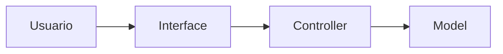
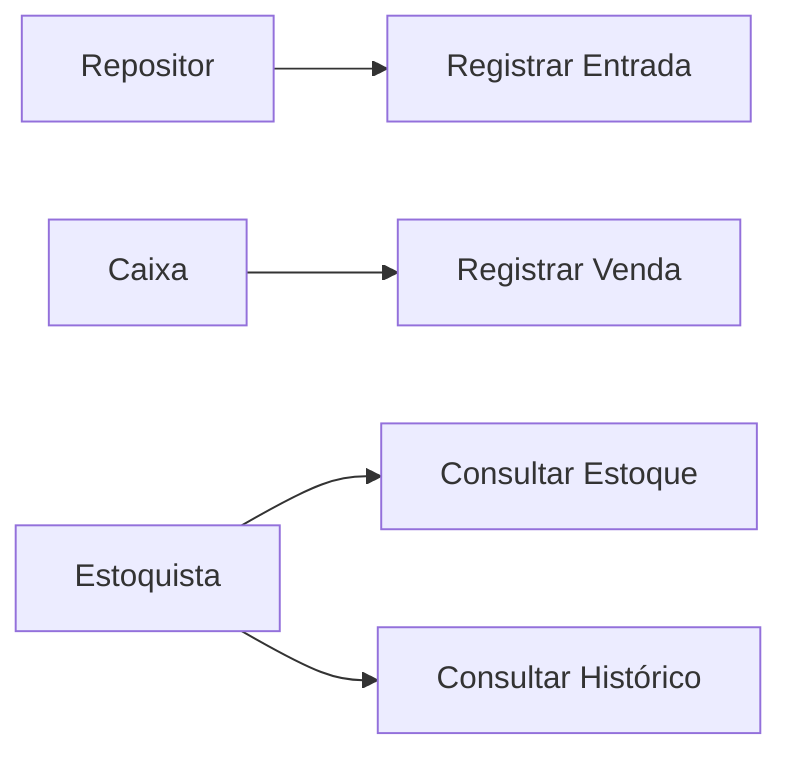
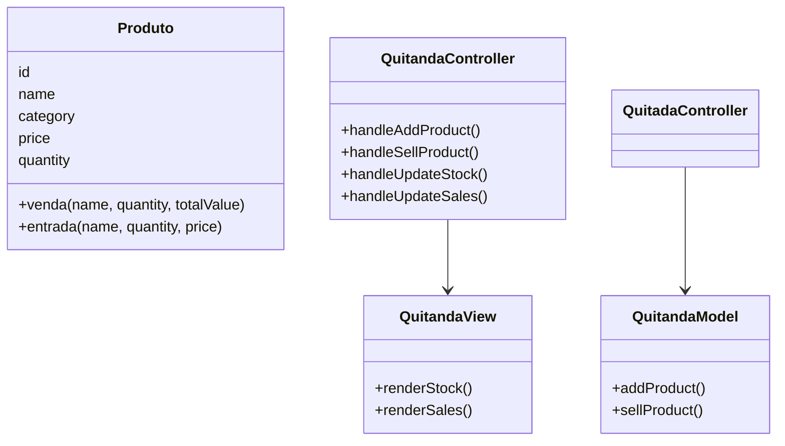
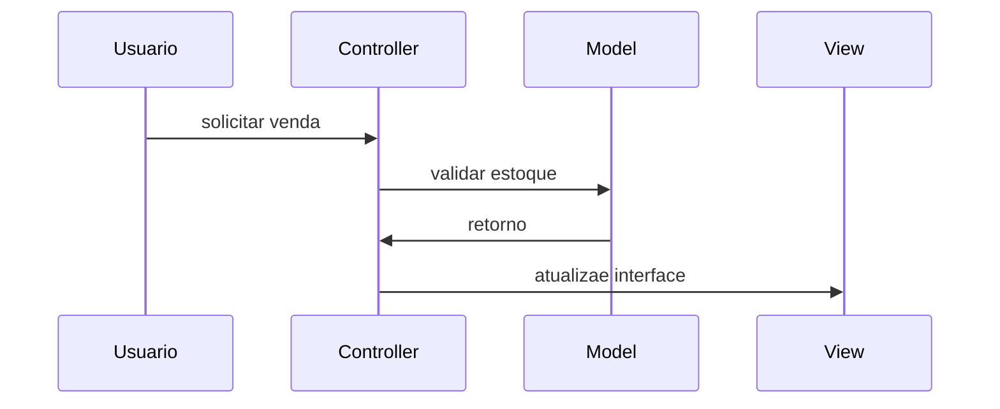
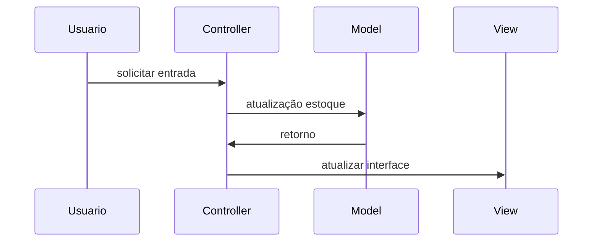
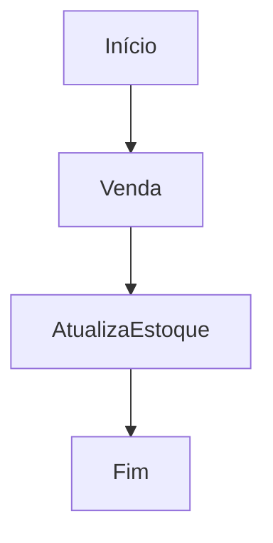
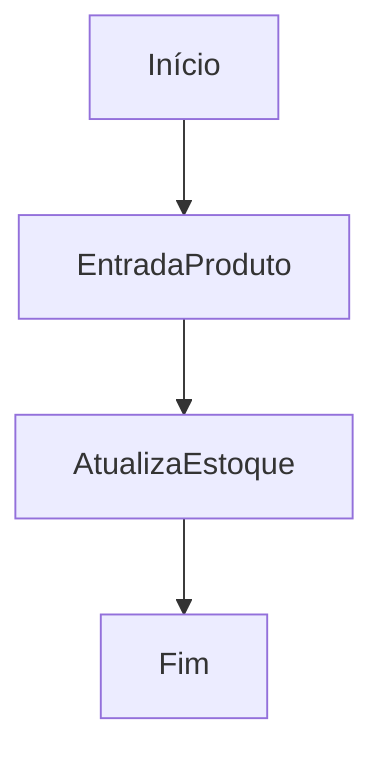
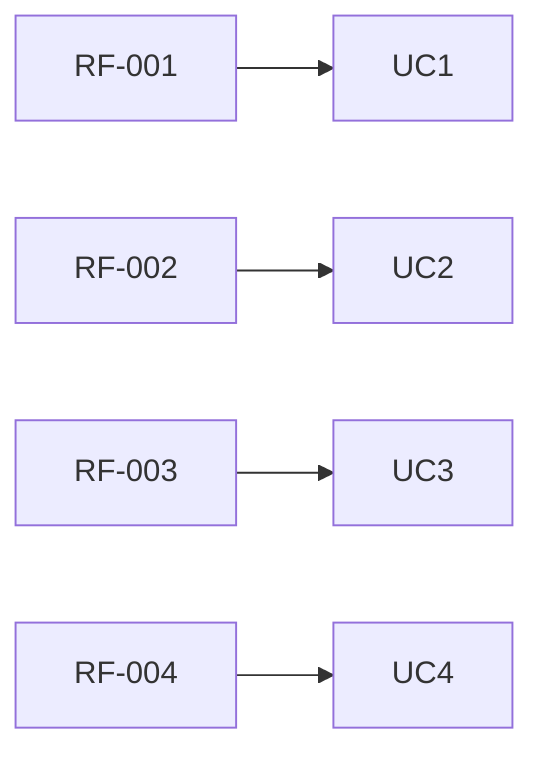

# Documentação de Especificações de Requisito de Software (SRS)
Documento baseado na ISO/IEEE 29148:2018

## Sistema de Controle de Quitanda (Quitanda MVC)

- **Padrão:** ISO/IEC/IEEE 29148:2018
- **Versão:** 1.0.0
- **Data:** 2026-04-14
- **Autor:** Gabriela Machado

---

## 1. Introdução

### 1.1 Propósito

Este documento descreve os requisitos do sistema **Quitanda MVC**, com objetivo de:

* Definir funcionalidades
* Padronizar entendimento 
* Servir como base para desenvolvimento e testes

---

### 1.2 Escopo

O sistema permitirá:

* Registro de entrada de produtos
* Registro de vendas
* Controle de estoque
* Histórico de movimentações

O Sistema será uma aplicação web frontend utilizando:

* HTML
* CSS
* JavaScript
* Arquitetura MVC
* Estrutura POO

---

### 1.3 Definições

| Termo   | Definições |
| ------- | ---------- |
| Produto | Item comercializado na quitanda |
| Entrada | Registro de chegada de produto |
| Venda   | Registro de saída de produto |
| Estoque | Quantidade disponível de produtos |

Acrônimos

* **SGQ** - Sistema de gestão de Quitanda
* **RF** - Requisito Funcional
* **RNF** - Requisito Não-Funcional

---

### 1.4 Visão Geral do Documento

Este documento está organizado em 

* Introdução e visão geral
* Descrição do sistema
* Requisitos detalhados 
* Modelos UML
* Regras de negócio

--- 

## 2. Descrição Geral do Sistema

### 2.1 Perspectiva do Sistema 

O sistema é standalone (somente frontend), operado em navegador

--- 

### 2.2 Fumções dos Sistemas

O Sistema deve:

* Cadastrar produtos
* Atualizar estoque
* Registrar vendas
* Validar operações
* Exibir dados 🎲

---

### 2.3 Classes de usuários

 | Usuários     | Descrição   |
 | ----------   | ----------- |
 | Estoquista   | Gerencia estoque |
 | Caixa        | Realiza vendas |
 | Repositor    | Registra entradas |

---

 ### 2.4 Ambiente Operacional

 * Navegador Web (Chrome, Edge, Firefox)

 ---

### 2.5 Restrições

* Não utiliza banco de dados 🎲
* Dados armazenados na memória
* Sem autenticação de usuário

### 2.6 Suposições

* Usuário possui conhecimetnos básico de informática
* Volume de dados em pequeno

---

## 3. Requistos do Sistema

### 3.1 Requisitos Funcionais

#### RF-001: Cadastro de produto

**Descrição:** Permitir cadastrar um produto

- **Prioridade:** Alta
- **Versão:** 1.0
- **Data:** 2026-04-14
- **Rastreabilidade:** Necessidade do Stakeholder 001

**Critérios de Aceitação:**
- [ ] Entrada de dados: nome, categoria, preço, quantidade
- [ ] Validação de campos 
- [ ] Verificação de duplicidade
- [ ] Saída: notificação ao usuário

---

#### RF-002: Atualizar Estoque

**Descrição:** Permitir atualização de dados de itens existentes

- **Prioridade:** Alta
- **Versão:** 1.0
- **Data:** 2026-04-14
- **Rastreabilidade:** Necessidade do Stakeholder 002

**Critérios de Aceitação:**
- [ ] Verificar se item já está cadastrado
- [ ] Entrada de dados: nome, categoria, preço, quantidade
- [ ] Validação de campos 
- [ ] Saída: Notificação ao Usuário

---

#### RF-003: Listagem de Estoque

**Descrição:** Exibir informações dos produtos cadastrados

- **Prioridade:** Alta
- **Versão:** 1.0
- **Data:** 2026-04-14
- **Rastreabilidade:** Necessidade do Stakeholder 003

**Critérios de Aceitação:**

- [ ] Listagem dos produtos
- [ ] Saída: id, nome, categoria, preço, quantidade

---

#### RF-004: Registro de Vendas

**Descrição:** Permitir vender produtos

- **Prioridade:** Alta
- **Versão:** 1.0
- **Data:** 2026-04-14
- **Rastreabilidade:** Necessidade do Stakeholder 004 

**Critérios de Aceitação:**
- [ ] Venda de produtos cadastro
- [ ] Verificação de quantidade
- [ ] Atualização do estoque
- [ ] Notificação de venda realizada

---

#### RF-005: Histórico de Movimetações

**Descrição:** Permitir o Registro de Movimentações (Entrada e Saída) de Produtos

- **Prioridade:** Média
- **Versão:** 1.0
- **Data:** 2026-04-14
- **Rastreabilidade:** Necessidade do Stakeholder 005

**Critérios de Aceitação:**
- [ ] Registro das movimentações em uma lista
- [ ] Consulta das movimentações
- [ ] Verificação de duplicidade
- [ ] Saída: notificação ao usuário

---

### 3.2 Requistos Não Funcionais

#### RNF-001: Usabilidade

**Descrição:** Interface simples e intuitiva

---

#### RNF-002: Desempenho

**Descrição:** Respostas rápidas e inferiores a 1 segundo

---

#### RNF-003: Arquitetura MVC

**Descrição:** Estruturação da arquitetura do código em MVC

---

#### RNF-004: Confiabilidade

**Descrição:** Validação de entrada de dados obrigatória

---

## 4. Regras do Negócio

Tabela de regras de negócio

| Regras de Negócio | Descrição |
| ----------------- | --------- |
| RN-001            | Quantidade de produtos não pode ser negativa |
| RN-002            | Preço do produto não pode ser negativo |
| RN-003            | Nome do produto é obrigatório |
| RN-004            | Venda só pode ser realizada se estoque for suficiente |
| RN-005            | Toda movimentação deve ser registrada |

--- 

Podem existir restrições para o negócio (legais, movimentação, local, etc)

## 5. Modelos do Sistema

### 5.1 Diagrama de Casos de Uso

Diagrama de Casos de Uso: O que o sistema deve fazer do ponto de vista do usuário

### 5.2 Diagrama de Classes UML

Diagrama de Classes UML: Estrutura de código, classes, atributos e métodos

--- 

### 5.3 Diagrama de Sequência

Diagrama de Sequência: Interação entre objetos ao longo do tempo para realização de uma funcionalidade específica

#### 5.3.1 Venda

#### 5.3.2 Atualização de Estoque

### 5.4 Diagrama de Atividades

Diagrama de Atividades: fluxo de atividades para realização de uma funcionalidade específica

#### 5.4.1  Venda

#### 5.4.1  Entrada

## 6. Análise de Risco

### 6.1 Matriz de Análise de Risco

| Risco      | Impacto   | Mitigação |
| - | - | - |
| Perda de Dados | Alto | usar localStorage |
| Entrada de Dados | Médio | validar as entradas de dados |

---

## 7. Controle de Versão

### 7.1 Histórico de Alterações

| Versão | Data | Autor | Modificação |
| - | - | - | - |
| 1.0.0 | 2026-04-14 | Gabriela Machado | Versão Inicial |

### 7.2 Aprovações

| Papel | Nome | Data | Assinatura |
| - | - | - | - |
| Stakeholer | Evelyn Levindo | 2026-04-15 | [ ] |

### 7.3 Rastreabilidade

Fluxo de Rastreabilidade: relacionamento entre requisitos, casos de uso, testes e códigos
 

